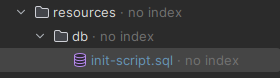

# API Task management

The main purpose of the task management project is to manage, organize and track daily tasks, projects and goals. Where new tasks can be created, set due dates, assign priorities, add descriptions and track the progress of each task. Search and filter functions can be performed, users can quickly find the tasks they need to complete, which helps to be a task registry where CRUD operations can be performed, add tasks, list tasks, edit tasks or delete tasks. This project was developed in C# making use of a Rest. .NET SDK API (version 8.0 or later) and the ASP.NET Core Web API framework. The project was developed on Linux using the Rider IDE, but it is cross-platform, so it can be run on operating systems other than Linux.

## Steps to start the application

#### 1. Clone repository

In order to deploy and run the application along with the database configuration, it is necessary to have the corresponding repository cloned on your machine. This can be achieved with the following command:

```bash
git clone https://github.com/DaynorTito/API-Tasks.git
```

#### 2. Start docker compose 

After cloning the repository, navigate to the `resources` folder, which contains the files needed for the environment configuration

```bash
cd resources
```

Then, in order to start the Docker container with the configuration in the Docker Compose file, you must make use of the command:

```bash
sudo docker compose up -d
```

Then, at this point, you can verify that the container is running correctly with the following command on Linux operating systems:

```bash
sudo docker ps
```

#### 3. Program execution

After starting the database you can make use of the API driver to verify the CRUD operation, to do this you must be located in the **ApiTask.Api** directory 

```bash
cd ..
cd ApiTask.Api
```

and execute the following command:

```bash
dotnet build
dotnet run
```

#### 4. Verification

The server will be listening on 

```bash
http://localhost:5045
```

After we are up and running, we must perform the basic authentication process.

## User authentication
In the API it will not be allowed to perform modification actions without being authenticated, since only entities could be listed.
Authentication is done with a Basic Authentication that must be done in postman, adding an Authentication header and the credentials of a valid user in Basic Authentication.


Then enter the credentials of a valid user in the basic authentication fields in postman and make the desired request.


The get methods do not require authentication, but the modify, create and delete methods do require authentication.

### GetTasks
Description: Retrieves all tasks from the database.
HTTP Method: GET
Endpoint:

```bash
/api/Task
```
Usage: Access this endpoint using a web browser or API client like Postman.
Response: Returns a JSON object with a message and an array of tasks.

### GetTaskById
Description: Retrieves a specific task by its ID.
HTTP Method: GET
Endpoint:

```bash
/api/Task/{id}
```
Usage: Replace {id} with the ID of the task you want to retrieve. Access this endpoint using a web browser or API client like Postman.
Response: Returns a JSON object with a message and the task details if found, or a 404 status code if the task is not found.

### CreateTask
Description: Creates a new task.
HTTP Method: POST
Endpoint:

```bash
/api/Task
```
Usage: Send a POST request with a JSON object representing the task to be created in the request body. Access this endpoint using an API client like Postman.
Response: Returns a JSON object with a message indicating the success or failure of the creation process, along with the details of the created task if successful.

### UpdateTask
Description: Updates an existing task.
HTTP Method: PUT
Endpoint:

```bash
/api/Task/{id}
```
Usage: Replace {id} with the ID of the task you want to update. Send a PUT request with a JSON object representing the updated task in the request body. Access this endpoint using an API client like Postman.
Response: Returns a JSON object with a message indicating the success or failure of the update process, along with the details of the updated task if successful.

### DeleteTask
Description: Deletes a task.
HTTP Method: DELETE
Endpoint:

```bash
/api/Task/{id}
```

Usage: Replace {id} with the ID of the task you want to delete. Send a DELETE request to this endpoint. Access this endpoint using an API client like Postman.
Response: Returns a JSON object with a message indicating the success or failure of the deletion process.


### List of tasks and associated users

Description: Retrieves a list of users along with their associated tasks.
HTTP Method: GET
Endpoint:

```bash
/api/User/usersWithTasks
```

Usage: Send a GET request to this endpoint to retrieve a list of users along with their associated tasks. Access this endpoint using an API client like Postman.
Response: Returns a JSON object containing a message indicating the success or failure of the request, along with the list of users and their tasks. If successful, the HTTP status code will be 200 (OK); otherwise, it will be 500 (Internal Server Error).


## Group Tasks
### Creation of task groups
Description: Creates a new group task.
HTTP Method: POST
Endpoint:

```bash
/api/GroupTask
```
Usage: Send a POST request to this endpoint with the necessary parameters in the request body to create a new group task. Access this endpoint using an API client like Postman. Ensure that you are authorized to create a group task by including valid authorization credentials in the request header.
Response: Returns a JSON object containing a message indicating the success or failure of the creation process, along with details of the newly created group task. If successful, the HTTP status code will be 201 (Created); otherwise, it will be 500 (Internal Server Error).


### List a customer's tasks in a sorted priority order
Description: Retrieves tasks for a specific user based on priority.
HTTP Method: GET
Endpoint:
```bash
/api/Task/{userId}/{priority}
```
Usage: Send a GET request to this endpoint with the user ID ({userId}) and priority ({priority}) as parameters. The user ID specifies the user whose tasks you want to retrieve, and the priority parameter filters the tasks based on their priority level. Valid priority values include "high", "medium", "low", and "without priority". Access this endpoint using an API client like Postman.
Response: Returns a JSON object containing a message indicating the success or failure of the retrieval process, along with details of the tasks matching the specified criteria. If successful, the HTTP status code will be 200 (OK); otherwise, it will be 500 (Internal Server Error) or 400 (Bad Request) if an invalid priority is provided.


## Task status history
A task each time it changes its status, a record of status change is stored in a table, with which we can view a history of changes made in all modified tasks, a controller was created to manage this information, and thus be able to resgitros of modifcaicones tasks of a specific user.

### GetStatusHistories
Description: Retrieves all status histories from the database.
HTTP Method: GET

Endpoint:
```bash
/api/StatusHistory
```
Response: Returns a JSON object with a message and an array of status histories.

### GetStatusHistoryById
Description: Retrieves a specific status history by its ID.
HTTP Method: GET

Endpoint:
```bash
/api/StatusHistory/{id}
```
Usage: Replace {id} with the ID of the status history you want to retrieve.
Response: Returns a JSON object with a message and the status history details if found, or a 404 status code if the status history is not found.

### CreateStatusHistory
Description: Creates a new status history.
HTTP Method: POST

Endpoint:
```bash
/api/StatusHistory
```
Usage: Send a POST request with a JSON object representing the status history to be created in the request body.
Response: Returns a JSON object with a message indicating the success or failure of the creation process, along with the details of the created status history if successful.

### DeleteStatusHistory
Description: Deletes a status history.
HTTP Method: DELETE

Endpoint:
```bash
/api/StatusHistory/{id}
```
Usage: Replace {id} with the ID of the status history you want to delete. Send a DELETE request to this endpoint.
Response: Returns a JSON object with a message indicating the success or failure of the deletion process.

### GetStatusHistoriesByUserId
Description: Retrieves all status histories associated with a specific user.
HTTP Method: GET

Endpoint:
```bash
/api/StatusHistory/user/{userId}
```
Usage: Replace {userId} with the ID of the user whose status histories you want to retrieve.
Response: Returns a JSON object with a message and an array of status histories associated with the specified user.

## SQLite database migration process
The initial MySQL database was modified, adding more resources and a table to register the status of the tasks.
The new database has 100 users and 20 tasks for each user, plus a group of tasks for each user and some task status history status.
The insertion of the data is done directly with SQL statements for MySQL and is located in the directory resources/db.



### 1. Backing up the current database
To do this we must establish the connection in MySQL Workbench, go to Server, then Export Data.


The backup will be exported to a default directory, where MySQL stores its backups.


The backup file is moved to the project.
```bash
mv /home/$user/snap/mysql-workbench-community/13/dumps/Dump20240428.sql backupDB/
```
### 2. Migration of the database to SQLite
#### 2.1 Installing SQLite on Ubuntu 22.04 Linux

We install SQLite with the command from the terminal:
```bash
sudo apt install sqlite3
```

Then, if you have already installed the manager, you can optionally install DB Browser for SQLite from the Ubuntu Linux package installer.


We add the SQLite driver in the project with the following command

```bash
dotnet add package System.Data.SQLite
```
#### 2.2 Data Migration
Before making the migration, all comments and extra lines in the backup file previously generated from Workbench were removed to avoid issues with the migration to SQLite.

The migration of the DB is already done at the beginning with the backup file that you have, when you run the main project, so to perform the migration you must run the main project.

The Migration Script class in the ApiTask.Data/Migration directory is executed.

```bash
 cd ../ApiTask.Api/
 dotnet build
 dotnet run
```
The db is created with the name: **daynor.tito.sqlite** in the ApiTask.Data/Migration directory.

## Verify Data Integrity
To verify data integrity we will perform sql queries in the MySQL manager using Workbench and the same query in SQLite from DB Browser and compare the results.
All queries performed are in the /resources/SQLVerification directory.


We open the db of the migration that was done when the project was executed, with DB Browser for SQLite and in the same way we open Workbench to make the following queries and compare their results:


### Count the number of tasks assigned to each user:

```sql
SELECT u.id, u.username, COUNT(t.id) AS task_count
FROM user u
LEFT JOIN task t ON u.id = t.user_id
GROUP BY u.id, u.username;
```


In both db we obtain the same result

### Find the tasks (tasks) that have an upcoming due date (due_date) (for example, in the next 7 days):

```sql
-- MySQL
SELECT *
FROM task
WHERE due_date >= DATE(NOW()) AND due_date <= DATE_ADD(DATE(NOW()), INTERVAL 7 DAY);

-- SQLite
SELECT *
FROM task
WHERE due_date >= DATE('now') AND due_date <= DATE('now', '+7 days');
```
Results MySQL:


Results SQLite:


In both db we obtain the same result

### Calculate the average duration of tasks (difference between creation date and due date):

```sql
-- MySQL
SELECT AVG(DATEDIFF(due_date, created_date)) AS avg_duration
FROM task
WHERE due_date IS NOT NULL;
    
-- SQLite
SELECT AVG(julianday(due_date) - julianday(created_date)) AS avg_duration
FROM task
WHERE due_date IS NOT NULL;
```
Results MySQL:


Results SQLite:


In both db we obtain the same result

### Get the 5 most recent tasks sorted by creation date.

```sql
SELECT *
FROM task
ORDER BY created_date DESC
LIMIT 5;
```
Results MySQL:


Results SQLite:


In both db we obtain the same result


### Show users along with the number of tasks they have in “in_progress”, “pending” or “completed” status,

```sql
SELECT u.username,
       COALESCE(in_progress_count, 0) AS in_progress_count,
       COALESCE(pending_count, 0) AS pending_count,
       COALESCE(completed_count, 0) AS completed_count
FROM user u
         LEFT JOIN (
    SELECT user_id,
           COUNT(CASE WHEN status = 'in_progress' THEN 1 END) AS in_progress_count,
           COUNT(CASE WHEN status = 'pending' THEN 1 END) AS pending_count,
           COUNT(CASE WHEN status = 'completed' THEN 1 END) AS completed_count
    FROM task
    GROUP BY user_id
) t ON u.id = t.user_id;
```
Results MySQL:


Results SQLite:


In both db we obtain the same result

### Count how many tasks of each priority each user has and display the total sum of their tasks:

```sql
SELECT u.id, u.username,
       COALESCE(SUM(CASE WHEN t.priority = 'high' THEN 1 ELSE 0 END), 0) AS high_priority_count,
       COALESCE(SUM(CASE WHEN t.priority = 'medium' THEN 1 ELSE 0 END), 0) AS medium_priority_count,
       COALESCE(SUM(CASE WHEN t.priority = 'low' THEN 1 ELSE 0 END), 0) AS low_priority_count,
       COUNT(t.id) AS total_tasks
FROM user u
         LEFT JOIN task t ON u.id = t.user_id
GROUP BY u.id, u.username;
```
Results MySQL:


Results SQLite:


In both db we obtain the same result

## Modifications of Context

After migrating the db we make changes in the project so that now the project uses the SQLite db, for that we generate a new context with the following command:

```bash
 dotnet ef dbcontext scaffold "Data Source=../ApiTask.Data/Migration/daynor.tito.sqlite.db" Microsoft.EntityFrameworkCore.Sqlite --output-dir ../ApiTask.Data/
```

Then we delete the previous MySQL Context, then the project will be working with SQLite and the checks of the drivers and endpoints can be performed without any problem.


## Unit Tests
The unit tests performed to some classes of the project can be found in the ApiTask.Test sub-project.


### swagger

To access Swagger which is a tool for documenting and consuming APIs more easily and effectively. The url must be accessed from a browser:

```bash
http://localhost:5045/swagger/index.html
```


It allows you to describe the API structure, including available endpoints, supported HTTP methods, required and optional parameters, and expected responses.


## Stop and delete containers
If you are done using the endpoints you should terminate or remove the Docker container from the previously started database and if you want to stop and delete the container so that it no longer runs in the background, you can use the following commands:


```bash
cd ..
cd resources
```

```bash
sudo docker compose down -v
```
This command will stop the running containers, with the `-v` option, it will also remove the associated volumes, ensuring that no data remains.


